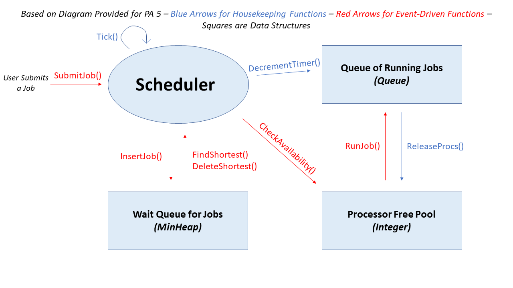

Kace Cottam (11609561)  
Maia Whitley (11625970)  
Programming Assignment 5  
CPTS223.01  

Programming Assignment 5
===

Scheduler System Design
-----------------------

For the queue of waiting jobs, we used a MinHeap so that it would be efficient to find the next shortest job. The shortest job remains conveniently at the top
of the heap, so accessing it through top() is in constant time. Deleting this shortest job is in O(logn) to allow for percolation of jobs. 

For the queue of running jobs, we used a vector, allowing us to easily add and remove jobs as well as iterate through the vector to decrement the timer for each job.

To keep track of the available processors, we used an unsigned integer (in the form of std::size_t). When a job is added to the running queue, the number of processors it needs
is subtracted from the number of available processors, and when it is completed, that number of processors is added back.

Runtime Complexities
--------------------

| Function          | Complexity |
| ----------------- | ---------- |
| InsertJob         | O(logn)    |
| CreateJob         | O(1)       |
| ReadJob           | O(n)       |
| FindShortest      | O(1)       |
| DeleteShortest    | O(logn)    |
| CheckAvailibility | O(1)       |
| RunJob            | O(1)       |
| DecrementTimer    | O(n)       |
| ReleaseProcs      | O(1)       |

InsertJob - Insert into job\_queue

CreateJob - Just makes checks with parameters

ReadJob - Depends on how many characters we have to read or ignore.

FindShortest - Because we are using a minheap, the shortest job is the first value.

DeleteShortest - Because we are using a minheap, delete the shortest value and percolate

CheckAvailibility - It just compares values, so O(1)

RunJob - it adds to the end of a vector

DecrementTimer - Needs to visit all values in running\_jobs

ReleaseProcs - just a subtraction and removal from vector

Short-Comings of Shortest-Job-First Strategy
--------------------------------------------

One of the major disadvantages of the shortest-job-first strategy is that it's optimizing jobs purely based
on which one takes the least amount of time to run. This overlooks the importance of the number of processors, the length of time
a job has been in the queue, and the importance of a job. For example, a job that was just inserted that takes 4 ticks and uses
20 processors would always be prioritized over a job that has been waiting in the queue, takes 5 ticks, and uses 1 processor. 
This could result in the inefficient use of resources and longer jobs could wait in the queue indefinitely if shorter jobs
continue to be added. 

From a performance standpoint, the shortest-job-first strategy doesn't seem to offer a significant benefit over a 
first-come-first-serve strategy and adds additional time complexity for jobs to percolate within the priority queue as 
opposed to jobs simply being added to the end of a regular queue for a first-come-first-serve approach.

On the Use of Optional and Variant Return Statements
----------------------------------------------------
We used optional return statements in order for the reader of the code to have a better
understanding of what the function does; it can return an exception, or it can return nothing.
We also used variants for returning an exception or returning nothing. That way,
the reader knows that they must handle the error-- as opposed to a `throw` statement
where it is not explicitly said that a function can throw an error in the declaration.

